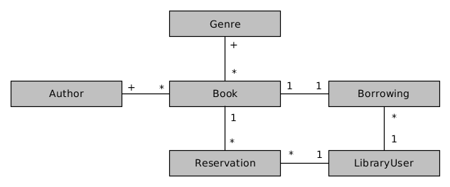

# django-library-manager
A management system for a library using Django. As of now, it is possible for admins to add books, authors and genres.
Users can reserve books and admins can lend books to users.

--------------------------------

## Setup development environment
Python version 3.6 is used. Add a virtual environment for it in the project root and activate it:

    python3 -m venv venv
    source venv/bin/activate

Install `pipenv` for package management and development packages with `pipenv`:

    pip install pipenv
    pipenv install -d

Seed development database:

    python manage.py loaddata library_app/fixtures/*

--------------------------------

## Run development server

    python manage.py runserver

--------------------------------

## Architecture
In a Django project the project consists of a 'site' which wraps all the Django 'apps' together. Currently the 'site'
is under the `library_site` directory and there is only one app under the `library_app` directory.

### Site library_site
The site combines app urls to a single `urls.py` file and contains the website layout which uses Bootstrap 4 as its
CSS framework.

### App library_app
This app contains the core functionality. 

#### Directory and file structure
In addition to the default Django app structure, `models`, `views` and `tests` are divided to their own files to avoid
a single bloated files. Also, there is the `sample` directory which contains "business" logic.

The `test` directory structure mimics the app structure rather than being divided by test types.

#### Database structure
The following diagram represents the database structure of `library_app`. If there are `many-to-many` relations between
models in the diagram, there is a junction table between them.

There are also Django's default database tables which are not represented in the picture. The only notable table which
interacts with `library_app` is the `User` table. It has a `one-to-one` relation with `LibraryUser` table. This is done
to decouple other models from non-app related tables (this also makes it possible to create custom methods to users
which would not otherwise be possible).
